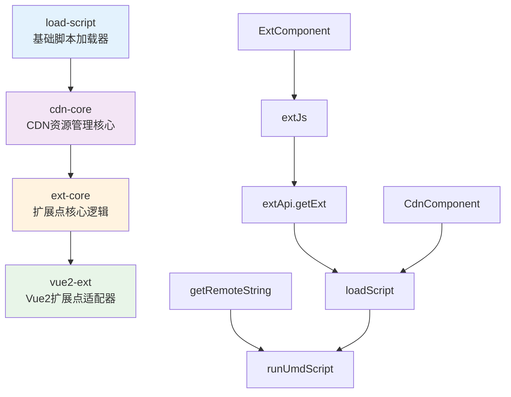

# Vue2 Extension System - 一期开发计划

## 🎯 项目总体目标

**项目名称**: Vue2 Extension System

**开发周期**: 4-6周

**技术栈**: TypeScript + Vue2 + Rollup

**目标**: 实现一个支持Vue2的扩展点系统

## 📦 功能包架构设计

### 核心功能包（4个）



## 📅 详细开发计划

### 🔵 第一阶段：基础脚本加载器 (Week 1)

#### Package: `load-script`

**开发任务清单：**

| 任务 | 文件             | 功能描述           | 工时估算 |
| ---- | ---------------- | ------------------ | -------- |
| 1.1  | `src/fetch.ts`   | 实现HTTP请求方法   | 1天      |
| 1.2  | `src/scripts.ts` | 实现UMD脚本执行    | 2天      |
| 1.3  | `src/utils.ts`   | 工具函数和错误处理 | 0.5天    |
| 1.4  | `src/index.ts`   | 主入口和缓存机制   | 1天      |
| 1.5  | 单元测试         | Jest测试用例       | 1.5天    |

**实现目标：**

```typescript
// 核心API设计
interface LoadScriptAPI {
  // 获取远程字符串内容
  getRemoteString(url: string): Promise<string>;

  // 执行UMD脚本并返回模块
  runUmdScript(url: string, code: string): Promise<any>;

  // 组合方法：加载+执行
  loadScript(url: string): Promise<any>;

  // HTTP工具方法
  postData<T>(url: string, data: any, headers?: any): Promise<T>;
  getData<T>(url: string, headers?: any): Promise<T>;
}
```

**验收标准：**

- ✅ 支持加载远程JavaScript文件
- ✅ 支持UMD模块解析和执行
- ✅ 基本的缓存机制（内存缓存）
- ✅ 错误处理和重试机制
- ✅ 单元测试覆盖率 ≥ 80%

**简化实现要点：**

- 保留基本的缓存机制
- 保留错误处理

**二期优化点：**

- 沙箱机制

---

### 🟢 第二阶段：CDN资源管理核心 (Week 2)

#### Package: `cdn-core`

**开发任务清单：**

| 任务 | 文件                | 功能描述              | 工时估算 |
| ---- | ------------------- | --------------------- | -------- |
| 2.1  | `src/config.ts`     | 配置管理和URL处理     | 1天      |
| 2.2  | `src/loadScript.ts` | CDN资源加载逻辑       | 2天      |
| 2.3  | `src/utils.ts`      | 调试和日志工具        | 0.5天    |
| 2.4  | `src/index.ts`      | 导出和集成            | 0.5天    |
| 2.5  | 集成测试            | 与load-script集成测试 | 1天      |

**实现目标：**

```typescript
// 配置接口
interface CdnConfig {
  baseUrl?: string; // CDN基础URL
  timeout?: number; // 请求超时时间
  retryCount?: number; // 重试次数
  debug?: boolean; // 调试模式
  errorHandler?: (error: Error) => void;
}

// 核心方法
interface CdnCoreAPI {
  // 配置管理
  setCdnConfig(config: CdnConfig): void;
  getCdnConfig(): CdnConfig;
  getUrl(path: string): string;

  // 资源加载
  loadScript<T>(path: string, exportName?: string): Promise<T>;
  systemImport<T>(path: string, exportName?: string): Promise<T>;
}
```

**验收标准：**

- ✅ 支持相对路径和绝对路径处理
- ✅ 支持导出名称指定（exportName）
- ✅ 支持多次重试机制
- ✅ 统一的错误处理
- ✅ 调试模式和日志输出
- ✅ 与simple-load-script完美集成

**简化实现要点：**

- 保留重试机制和错误处理
- 简化配置项

**二期优化点：**

- 支持micro-app

---

### 🟡 第三阶段：扩展点核心逻辑 (Week 3-4)

#### Package: `ext-core`

**开发任务清单：**

| 任务 | 文件               | 功能描述         | 工时估算 |
| ---- | ------------------ | ---------------- | -------- |
| 3.1  | `src/config.ts`    | 扩展点配置管理   | 1天      |
| 3.2  | `src/api/index.ts` | 扩展点API请求    | 3天      |
| 3.3  | `src/api/sign.ts`  | 请求签名算法     | 1天      |
| 3.4  | `src/extJs.ts`     | JS扩展点逻辑     | 2天      |
| 3.5  | `src/start.ts`     | 启动和初始化     | 1天      |
| 3.6  | 缓存策略           | localStorage缓存 | 1天      |
| 3.7  | 集成测试           | API测试和Mock    | 1天      |

**实现目标：**

```typescript
// 扩展点配置
interface ExtConfig extends CdnConfig {
  appName: string; // 应用名称
  appGroup: string; // 应用组
  apiUrl: string; // 扩展点API地址
  accessKey?: string; // 访问密钥
  accessSecret?: string; // 访问秘钥
  cacheDuration?: number; // 缓存时长(分钟)
}

// 扩展点定义
interface Ext {
  name: string; // 扩展点名称
  type: 'cdn'; // 类型（简化版只支持cdn）
  url: string; // 资源URL
  conditions: Record<string, string>; // 条件参数
}

// 检查器函数
type CheckerType = (conditions: Record<string, string>) => boolean;

// JS扩展点选项
interface ExtJsOptions {
  name: string; // 扩展点名称
  checker: CheckerType; // 检查函数
  blockOnError?: boolean; // 错误时是否阻塞
  exportName?: string; // 导出名称
  errorHandler?: (error: Error) => void;
  originFn?: (...args: any[]) => any; // 原始函数
  devUrl?: string; // 开发调试URL
}
```

**验收标准：**

- ✅ 扩展点API请求和响应处理
- ✅ 基于localStorage的缓存策略
- ✅ 支持开发模式调试（devUrl）
- ✅ 错误处理和降级策略
- ✅ JS扩展点包装函数
- ✅ 请求签名和认证
- ✅ 完整的TypeScript类型定义

**简化实现要点：**

- 扩展点API请求逻辑
- 缓存机制

**二期优化点：**

- 支持react
- 支持WebComponent

---

### 🔴 第四阶段：Vue2组件适配器 (Week 5)

#### Package: `vue2-ext`

**开发任务清单：**

| 任务 | 文件                   | 功能描述           | 工时估算 |
| ---- | ---------------------- | ------------------ | -------- |
| 4.1  | `src/CdnComponent.vue` | CDN组件渲染器      | 2天      |
| 4.2  | `src/ExtComponent.vue` | 扩展点组件         | 2天      |
| 4.3  | `src/config.js`        | Vue2配置管理       | 0.5天    |
| 4.4  | `src/index.js`         | 统一导出           | 0.5天    |
| 4.5  | 组件测试               | Vue Test Utils测试 | 1天      |

**实现目标：**

##### CdnComponent.vue

```vue
<template>
  <div class="cdn-component">
    <!-- 加载状态 -->
    <div v-if="loading" class="loading">
      <slot name="loading">{{ loadingText }}</slot>
    </div>

    <!-- 错误状态 -->
    <div v-else-if="hasError" class="error">
      <slot name="error">{{ errorText }}</slot>
    </div>

    <!-- 动态组件渲染 -->
    <component v-else-if="dynamicComponent" :is="dynamicComponent" v-bind="comProps" v-on="comEvents" />

    <!-- 默认内容 -->
    <div v-else>
      <slot></slot>
    </div>
  </div>
</template>
```

##### ExtComponent.vue

```vue
<template>
  <div class="ext-component">
    <!-- 加载扩展点中 -->
    <div v-if="loadingExt" class="loading-ext">
      <slot name="loading">正在加载扩展点...</slot>
    </div>

    <!-- 无扩展点时显示默认内容 -->
    <div v-else-if="!ext">
      <slot></slot>
    </div>

    <!-- 有扩展点时渲染CDN组件 -->
    <CdnComponent
      v-else
      :url="ext.url"
      :export-name="exportName"
      :com-props="comProps"
      :com-events="comEvents"
      :error-handler="errorHandler"
      :loading-handler="loadingHandler"
    >
      <template #loading>
        <slot name="loading"></slot>
      </template>
      <template #error>
        <slot name="error"></slot>
      </template>
      <slot></slot>
    </CdnComponent>
  </div>
</template>
```

**验收标准：**

- ✅ CdnComponent支持动态组件渲染
- ✅ ExtComponent支持扩展点加载
- ✅ 完整的加载和错误状态处理
- ✅ 插槽支持（loading、error、default）
- ✅ Props和Events透传
- ✅ Vue2组件单元测试

**简化实现要点：**

- 支持vue2

- 支持cdn模式

**二期优化点：**

- 支持WebComponent
- 支持iframe

---

### 🚀 第五阶段：集成测试和文档 (Week 6)

**开发任务清单：**

| 任务 | 描述     | 工时估算       |
| ---- | -------- | -------------- | --- |
| 5.1  | E2E测试  | 端到端功能测试 | 2天 |
| 5.2  | 示例项目 | 完整的Demo应用 | 1天 |
| 5.3  | API文档  | 详细的使用文档 | 1天 |
| 5.4  | 部署脚本 | NPM发布和CI/CD | 1天 |

## 📊 项目里程碑

| 里程碑 | 时间节点   | 交付物                    | 成功标准             |
| ------ | ---------- | ------------------------- | -------------------- |
| M1     | Week 1 End | simple-load-script v1.0.0 | 基础脚本加载功能完成 |
| M2     | Week 2 End | simple-cdn-core v1.0.0    | CDN资源管理功能完成  |
| M3     | Week 4 End | simple-ext-core v1.0.0    | 扩展点核心逻辑完成   |
| M4     | Week 5 End | simple-vue2-ext v1.0.0    | Vue2组件适配器完成   |
| M5     | Week 6 End | 完整系统 v1.0.0           | 可用于生产环境       |

## 🔧 技术实现要求

### 开发规范

- **语言**: TypeScript 5+
- **构建工具**: Rollup + TypeScript
- **测试框架**: vitest + Vue Test Utils
- **代码规范**: ESLint + Prettier
- **版本管理**: Conventional Commits
- **包管理**: pnpm Workspaces

### 项目结构

```
simple-vue2-extension/
├── packages/
│   ├── load-script/
│   │   ├── src/
│   │   ├── tests/
│   │   ├── package.json
│   │   └── README.md
│   ├── cdn-core/
│   │   ├── src/
│   │   ├── tests/
│   │   ├── package.json
│   │   └── README.md
│   ├── ext-core/
│   │   ├── src/
│   │   ├── tests/
│   │   ├── package.json
│   │   └── README.md
│   └── vue2-ext/
│       ├── src/
│       ├── tests/
│       ├── package.json
│       └── README.md
├── examples/
│   └── vue2-demo/
├── docs/
│   ├── api/
│   ├── guide/
│   └── examples/
├── scripts/
│   ├── build.js
│   ├── test.js
│   └── release.js
├── DEVELOPMENT_PLAN.md
├── README.md
└── package.json
```

## 💻 使用示例

### 初始化系统

```javascript
import { startVue2Ext } from '@your-org/vue2-ext';

startVue2Ext({
  appName: 'your-app',
  appGroup: 'your-group',
  apiUrl: 'https://api.example.com',
  baseUrl: 'https://cdn.example.com'
});
```

### Vue组件中使用

```vue
<template>
  <div>
    <!-- 扩展点组件 -->
    <ExtComponent
      name="order.create"
      :checker="orderChecker"
      :com-props="{ orderId: 123 }"
      :com-events="{ onSave: handleSave }"
    >
      <div>默认内容</div>
    </ExtComponent>

    <!-- 直接使用CDN组件 -->
    <CdnComponent url="/components/button.js" export-name="Button" :com-props="{ text: '点击' }" />
  </div>
</template>

<script>
import { ExtComponent, CdnComponent } from '@your-org/simple-vue2-ext';

export default {
  components: { ExtComponent, CdnComponent },
  methods: {
    orderChecker(conditions) {
      return conditions.module === 'order';
    },
    handleSave(data) {
      console.log('保存数据:', data);
    }
  }
};
</script>
```

### JS扩展点使用

```javascript
import { extJs } from '@your-org/simple-ext-core';

const enhancedSave = extJs({
  name: 'order.save',
  checker: conditions => conditions.module === 'order',
  blockOnError: false,
  originFn: data => defaultSave(data)
});

// 使用
enhancedSave({ orderId: 123, amount: 100 });
```

## ⚠️ 风险评估和应对策略

| 风险          | 影响 | 概率 | 应对策略                 |
| ------------- | ---- | ---- | ------------------------ |
| UMD解析复杂性 | 高   | 中   | 参考原项目实现，保持简化 |
| Vue2兼容性    | 中   | 低   | 充分测试不同Vue2版本     |
| API接口变更   | 中   | 中   | 设计灵活的配置机制       |
| 性能优化      | 低   | 中   | 后期优化，先保证功能     |

## 📈 验收标准总览

### 功能性要求

- ✅ 支持远程JavaScript资源加载
- ✅ 支持Vue2组件动态渲染
- ✅ 支持扩展点配置和管理
- ✅ 支持错误处理和降级
- ✅ 支持开发调试模式

### 非功能性要求

- ✅ 代码覆盖率 ≥ 80%
- ✅ 构建产物 ≤ 100KB (gzipped)
- ✅ 支持Vue 2.6+
- ✅ 支持现代浏览器（Chrome 70+, Firefox 70+, Safari 12+）
- ✅ 完整的TypeScript类型定义

## 🚦 开发状态跟踪

### 当前进度

- [ ] 第一阶段：load-script
- [ ] 第二阶段：cdn-core
- [ ] 第三阶段：ext-core
- [ ] 第四阶段：vue2-ext
- [ ] 第五阶段：集成测试和文档

### 版本发布计划

- **v0.1.0-alpha**: 第一阶段完成
- **v0.2.0-alpha**: 第二阶段完成
- **v0.3.0-beta**: 第三阶段完成
- **v0.4.0-beta**: 第四阶段完成
- **v1.0.0**: 正式版本发布

---
