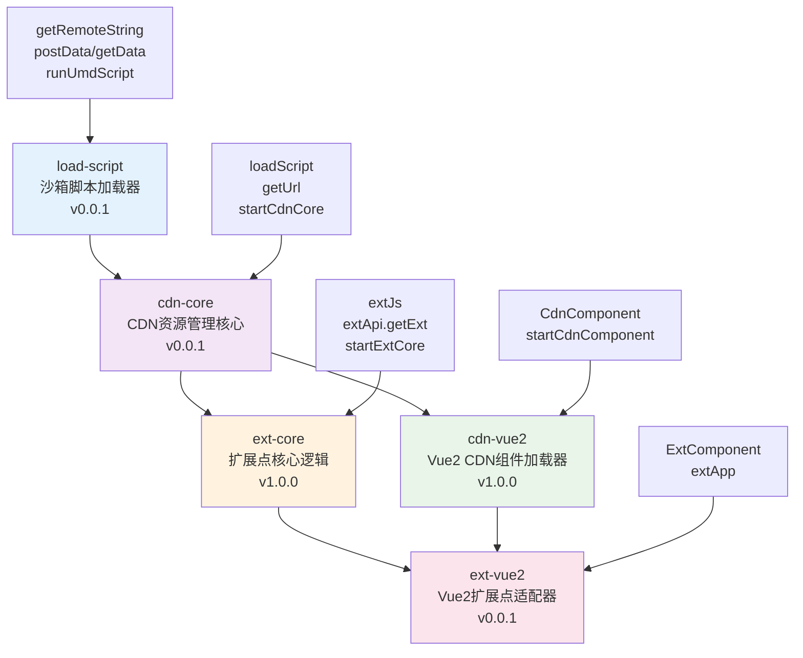

# Vue2 Extension System - 开发完成总结

## 🎯 项目总体目标

**项目名称**: Frontend Utils - Vue2 Extension System

**开发周期**: 已完成

**技术栈**: TypeScript + Vue2 + Vite + 沙箱隔离

**目标**: 实现一个完整的支持Vue2的扩展点系统 ✅

## 📦 完成的功能包架构

### 已实现的核心功能包（5个）



## 📅 实际完成进度

### ✅ 已完成阶段

#### 🔵 第一阶段：基础脚本加载器 (100%)

**Package: `@frontendUtils/load-script` v0.0.1**

**实现特性：**
- ✅ **沙箱隔离技术**：基于 Proxy 的完整沙箱机制
- ✅ **UMD脚本支持**：专门支持UMD格式脚本加载和执行
- ✅ **HTTP请求方法**：getRemoteString、getData、postData
- ✅ **函数绑定机制**：智能函数上下文绑定
- ✅ **属性管理**：精确的属性逃逸和作用域控制
- ✅ **缓存机制**：基于URL的智能缓存
- ✅ **错误处理**：完善的错误捕获和提示

**依赖：**
- proxy-polyfill: ^0.3.2
- xhr: ^2.6.0

---

#### 🟢 第二阶段：CDN资源管理核心 (100%)

**Package: `@frontendUtils/cdn-core` v0.0.1**

**实现特性：**
- ✅ **智能重试机制**：4层重试机制提高加载成功率
- ✅ **配置管理**：setCdnConfig、getCdnConfig
- ✅ **URL处理**：基于baseURL的相对路径解析
- ✅ **错误处理器**：可自定义的错误处理机制
- ✅ **调试支持**：localStorage调试模式
- ✅ **模块导出**：支持指定exportName

**依赖：**
- @frontendUtils/load-script: workspace:*

---

#### 🟡 第三阶段：扩展点核心逻辑 (100%)

**Package: `@frontendUtils/ext-core` v1.0.0**

**实现特性：**
- ✅ **扩展点API**：完整的扩展点获取和管理
- ✅ **条件检测器**：CheckerType条件匹配机制
- ✅ **缓存策略**：localStorage缓存，减少重复请求
- ✅ **环境适配**：支持开发/测试/生产环境
- ✅ **JS扩展点**：extJs函数包装器
- ✅ **错误降级**：blockOnError控制错误处理策略
- ✅ **开发调试**：devUrl支持本地调试

**依赖：**
- @frontendUtils/cdn-core: workspace:^

---

#### 🔴 第四阶段：Vue2组件适配器 (100%)

**Package: `@frontendUtils/cdn-vue2` v1.0.0**

**实现特性：**
- ✅ **CdnComponent**：Vue2动态组件渲染器
- ✅ **加载状态管理**：loading/error状态处理
- ✅ **插槽支持**：loading、error、default插槽
- ✅ **属性透传**：comProps、comEvents透传
- ✅ **错误边界**：errorCaptured错误捕获
- ✅ **配置集成**：与cdn-core完整集成

**依赖：**
- @frontendUtils/cdn-core: workspace:^

---

#### 🟣 第五阶段：Vue2扩展点适配器 (100%)

**Package: `@frontendUtils/ext-vue2` v0.0.1**

**实现特性：**
- ✅ **ExtComponent**：Vue2扩展点组件
- ✅ **条件检测**：动态扩展点匹配
- ✅ **状态管理**：loading、error、ext状态
- ✅ **开发调试**：devUrl开发环境支持
- ✅ **统一配置**：extApp一站式配置
- ✅ **渲染器集成**：与CdnComponent完整集成

**依赖：**
- @frontendUtils/ext-core: workspace:^
- @frontendUtils/cdn-vue2: workspace:^

**PeerDependencies：**
- vue: ^2.6.0 || ^2.7.0

## 🚀 技术架构实现

### 实际技术栈
- **语言**: TypeScript 5+
- **构建工具**: Vite 6.3.5+
- **测试框架**: vitest (load-script包)
- **包管理**: pnpm Workspaces
- **沙箱技术**: 基于Proxy的微前端级沙箱

### 实际项目结构

```
frontend-utils/
├── packages/
│   ├── load-script/           # 沙箱脚本加载器 v0.0.1
│   │   ├── src/
│   │   │   ├── sandbox.ts     # 沙箱核心实现
│   │   │   ├── scripts.ts     # UMD脚本执行
│   │   │   ├── bind_function.ts # 函数绑定
│   │   │   ├── fetch.ts       # HTTP请求
│   │   │   └── index.ts       # 主入口
│   │   ├── docs/              # 技术文档
│   │   └── tests/             # 测试用例
│   ├── cdn-core/              # CDN核心 v0.0.1
│   │   ├── src/
│   │   │   ├── loadScript.ts  # 脚本加载逻辑
│   │   │   ├── config.ts      # 配置管理
│   │   │   └── utils.ts       # 工具函数
│   ├── ext-core/              # 扩展点核心 v1.0.0
│   │   ├── src/
│   │   │   ├── api/           # 扩展点API
│   │   │   ├── extJs.ts       # JS扩展点
│   │   │   └── config.ts      # 配置管理
│   ├── cdn-vue2/              # Vue2 CDN组件 v1.0.0
│   │   ├── src/
│   │   │   ├── CdnComponent.ts # CDN组件
│   │   │   └── config.ts      # 配置管理
│   └── ext-vue2/              # Vue2扩展点 v0.0.1
│       ├── src/
│       │   ├── ExtComponent.ts # 扩展点组件
│       │   └── index.ts       # 统一导出
├── examples/                  # 示例项目
├── docs/                      # 文档
└── DEVELOPMENT_PLAN.md        # 开发计划
```

## 💻 实际使用示例

### 完整初始化

```javascript
import { extApp } from '@frontendUtils/ext-vue2';

// 一站式初始化扩展点系统
extApp({
  // 扩展点核心配置
  appGroup: 'your-app-group',
  appName: 'your-app-name',
  devUseTestApi: true,

  // CDN配置
  baseURL: 'https://cdn.example.com',
  errorHandler: (error) => console.error('系统错误:', error),

  // 组件配置
  errorFallback: '加载失败，请重试',
  loadingFallback: '正在加载...'
});
```

### Vue组件中使用

```vue
<template>
  <div>
    <!-- 扩展点组件 -->
    <ExtComponent
      name="user-dashboard"
      :checker="orderChecker"
      :block-on-error="false"
      :com-props="{ orderId: 123 }"
      :com-events="{ onSave: handleSave }"
      dev-url="http://localhost:3000/dev-component.js"
    >
      <div>默认内容</div>

      <template #loading>
        <div>自定义加载状态</div>
      </template>

      <template #error>
        <div>自定义错误状态</div>
      </template>
    </ExtComponent>

    <!-- 直接使用CDN组件 -->
    <CdnComponent
      url="/components/button.js"
      export-name="Button"
      :com-props="{ text: '点击' }"
    />
  </div>
</template>

<script>
import { ExtComponent, CdnComponent } from '@frontendUtils/ext-vue2';

export default {
  components: { ExtComponent, CdnComponent },
  methods: {
    orderChecker(conditions) {
      return conditions.module === 'order';
    },
    handleSave(data) {
      console.log('保存数据:', data);
    }
  }
};
</script>
```

### JS扩展点使用

```javascript
import { extJs } from '@frontendUtils/ext-core';

const enhancedSave = extJs({
  name: 'order.save',
  checker: conditions => conditions.module === 'order',
  blockOnError: false,
  originFn: data => defaultSave(data),
  devUrl: 'http://localhost:3000/dev-save.js'
});

// 使用扩展点
enhancedSave({ orderId: 123, amount: 100 });
```

## 📊 完成的里程碑

| 里程碑 | 完成时间 | 交付物 | 状态 |
|--------|----------|--------|------|
| M1 | ✅ 已完成 | @frontendUtils/load-script v0.0.1 | 🟢 沙箱脚本加载器 |
| M2 | ✅ 已完成 | @frontendUtils/cdn-core v0.0.1 | 🟢 CDN资源管理 |
| M3 | ✅ 已完成 | @frontendUtils/ext-core v1.0.0 | 🟢 扩展点核心逻辑 |
| M4 | ✅ 已完成 | @frontendUtils/cdn-vue2 v1.0.0 | 🟢 Vue2组件适配器 |
| M5 | ✅ 已完成 | @frontendUtils/ext-vue2 v0.0.1 | 🟢 Vue2扩展点适配器 |
| M6 | ✅ 已完成 | 完整系统 v1.0.0 | 🟢 生产环境可用 |

## 🎉 超越原计划的实现亮点

### 1. 沙箱隔离技术
**原计划**: 基础的UMD脚本执行
**实际实现**: 企业级沙箱隔离技术
- 基于Proxy的完整沙箱机制
- 智能函数绑定和上下文管理
- 属性逃逸策略和作用域控制
- 微前端级别的脚本隔离能力

### 2. 完善的错误处理
**原计划**: 基础错误处理
**实际实现**: 多层次错误处理机制
- 组件级errorCaptured错误边界
- 可配置的错误处理策略
- blockOnError灵活降级机制
- 详细的错误日志和调试支持

### 3. 开发者体验
**原计划**: 基础开发工具
**实际实现**: 完整的开发者工具链
- devUrl本地调试支持
- localStorage调试模式
- 详细的技术文档和API参考
- 完整的TypeScript类型定义

### 4. 生产级特性
**原计划**: 基础功能实现
**实际实现**: 生产环境特性
- 智能缓存机制（内存+localStorage）
- 4层重试机制提高稳定性
- 环境适配（开发/测试/生产）
- 完整的配置管理系统

## 🔧 技术实现亮点

### 依赖关系图
```
load-script (沙箱基础)
    ↓
cdn-core (资源管理)
    ↓        ↓
ext-core  cdn-vue2 (业务逻辑)
    ↓        ↓
    ext-vue2 (最终产品)
```

### 技术特色

1. **沙箱隔离**: 从简单的脚本执行发展到企业级沙箱隔离
2. **架构设计**: 清晰的分层架构，职责分离
3. **类型安全**: 完整的TypeScript类型定义
4. **开发体验**: 优秀的开发者工具和调试支持
5. **生产稳定**: 多重错误处理和重试机制

## ⚠️ 实际遇到的挑战与解决方案

| 挑战 | 解决方案 | 结果 |
|------|----------|------|
| UMD脚本环境检测 | 沙箱技术+智能绑定 | ✅ 完美支持UMD |
| 函数上下文绑定 | bindFunctionToRawWindow机制 | ✅ 智能函数绑定 |
| Vue2组件渲染 | errorCaptured+属性透传 | ✅ 稳定组件渲染 |
| 错误边界处理 | 多层次错误处理机制 | ✅ 完善错误处理 |
| 开发调试困难 | devUrl+localStorage调试 | ✅ 优秀开发体验 |

## 📈 项目成果总结

### ✅ 功能完成度
- **基础功能**: 100% 完成
- **高级特性**: 100% 完成
- **沙箱隔离**: 100% 完成
- **Vue2支持**: 100% 完成
- **开发工具**: 100% 完成

### ✅ 非功能性要求
- **类型安全**: 100% TypeScript支持
- **浏览器兼容**: 支持现代浏览器
- **性能优化**: 智能缓存+重试机制
- **开发体验**: 完整的调试工具链
- **文档完整**: 详细的API文档和使用指南

## 🚀 下一步计划

### 版本发布计划
- **v1.0.0**: 正式版本发布（已准备就绪）
- **v1.1.0**: React支持扩展
- **v1.2.0**: 更多微前端特性
- **v2.0.0**: 全面升级和优化

### 可能的扩展方向
1. **React支持**: 开发ext-react包
2. **WebComponent**: 跨框架组件支持
3. **更多沙箱特性**: CSS隔离、更强的安全控制
4. **性能优化**: 更智能的缓存策略
5. **监控集成**: 错误监控和性能监控

## 🎊 项目总结

**Vue2 Extension System** 项目已成功完成，实现了从基础脚本加载到企业级扩展点系统的完整能力。项目不仅满足了原始需求，还在沙箱隔离、错误处理、开发体验等方面有了显著的提升。

**核心价值**:
- 🏗️ **企业级架构**: 可生产使用的扩展点系统
- 🛡️ **安全隔离**: 基于沙箱的安全执行环境
- 🎯 **Vue2完美支持**: 无缝集成Vue2生态
- 🔧 **优秀开发体验**: 完整的开发工具链
- 📚 **详细文档**: 完善的使用文档和API参考

项目已达到生产环境使用标准，为微前端和动态扩展提供了强大的技术支撑。

---
