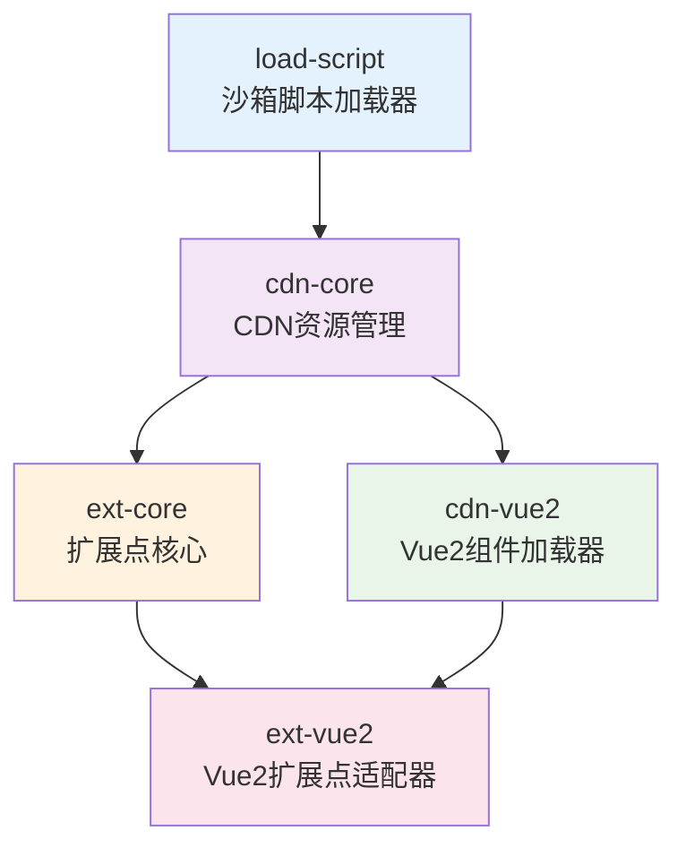

# Frontend Utils - Vue2 Extension System 使用指南

[](https://opensource.org/licenses/MIT)
[](https://www.typescriptlang.org/)
[](https://vuejs.org/)

> 一个企业级的 Vue 2 扩展点系统，支持动态加载远程组件、沙箱隔离、智能缓存和完善的错误处理机制。

## 📋 目录

- [快速开始](#快速开始)
- [系统架构](#系统架构)
- [包介绍](#包介绍)
- [安装配置](#安装配置)
- [基础使用](#基础使用)
- [高级功能](#高级功能)
- [扩展点开发](#扩展点开发)
- [调试指南](#调试指南)
- [最佳实践](#最佳实践)
- [故障排除](#故障排除)
- [API 参考](#api-参考)

## 🚀 快速开始

### 1. 安装依赖

```bash
# 安装核心包（通常只需要这一个）
npm install @frontendUtils/ext-vue2

# 或者根据需要安装特定功能包
npm install @frontendUtils/load-script    # 沙箱脚本加载器
npm install @frontendUtils/cdn-core       # CDN 资源管理
npm install @frontendUtils/ext-core       # 扩展点核心逻辑
npm install @frontendUtils/cdn-vue2       # Vue2 CDN 组件加载器
```

### 2. 环境配置

在应用入口配置环境变量：

```javascript
// main.js 或应用入口文件
window.ENVIRONMENT_EXT = {
  env: 'dev', // 环境标识：dev/test/prod
  'ares-ext': 'https://your-ext-api.com/api', // 扩展点 API 地址
  'jarvis-node-id': 'your-node-id', // 节点 ID
  gateway: 'https://your-gateway.com' // 网关地址
};
```

### 3. 初始化系统

```javascript
import { extApp } from '@frontendUtils/ext-vue2';

// 一站式初始化
extApp({
  // 扩展点核心配置
  appGroup: 'your-app-group',
  appName: 'your-app-name',
  devUseTestApi: true, // 开发环境使用测试 API

  // CDN 配置
  baseURL: 'https://your-cdn.com',
  errorHandler: (error) => {
    console.error('系统错误:', error);
    // 可集成错误监控系统
  },

  // 组件配置
  errorFallback: '加载失败，请重试',
  loadingFallback: '正在加载...'
});
```

### 4. 使用扩展点组件

```vue
<template>
  <div class="app">
    <h1>我的应用</h1>

    <!-- 扩展点组件 -->
    <ExtComponent
      name="user-dashboard"
      :checker="checkUserDashboard"
      :block-on-error="false"
      :com-props="{ userId: currentUser.id }"
      :com-events="{ onUserUpdate: handleUserUpdate }"
    >
      <!-- 默认内容 -->
      <div class="default-dashboard">
        <h2>默认用户面板</h2>
        <p>用户ID: {{ currentUser.id }}</p>
      </div>
    </ExtComponent>
  </div>
</template>

<script>
import { ExtComponent } from '@frontendUtils/ext-vue2';

export default {
  components: { ExtComponent },
  data() {
    return {
      currentUser: { id: 123, orgCode: 'ORG001' }
    };
  },
  methods: {
    checkUserDashboard(conditions) {
      // 条件检测：只有特定机构才显示扩展点
      return conditions.orgCode === this.currentUser.orgCode;
    },
    handleUserUpdate(userData) {
      console.log('用户数据更新:', userData);
    }
  }
};
</script>
```

## 🏗️ 系统架构



## 📦 包介绍

### 🔵 @frontendUtils/load-script
**沙箱脚本加载器** - 企业级的 JavaScript 脚本安全加载器

**特性：**
- 🛡️ 基于 Proxy 的沙箱隔离技术
- 📦 专门支持 UMD 格式脚本
- 🔄 智能缓存和重试机制
- ⚡ 高性能的函数绑定管理

### 🟢 @frontendUtils/cdn-core
**CDN 资源管理核心** - 智能的远程资源加载管理器

**特性：**
- 🚀 4层重试机制提高成功率
- 🔧 灵活的配置管理
- 📝 完整的调试日志支持
- 🌐 网络请求封装

### 🟡 @frontendUtils/ext-core
**扩展点核心逻辑** - 动态扩展点管理系统

**特性：**
- 🎯 条件检测和动态匹配
- 💾 智能缓存机制
- 🌍 多环境适配
- 🔄 错误降级策略

### 🟢 @frontendUtils/cdn-vue2
**Vue2 CDN 组件加载器** - Vue 2 动态组件渲染器

**特性：**
- ⚡ 动态组件渲染
- 🎨 插槽和事件透传
- 🛡️ 错误边界处理
- 📱 响应式状态管理

### 🟣 @frontendUtils/ext-vue2
**Vue2 扩展点适配器** - 完整的 Vue 2 扩展点解决方案

**特性：**
- 🎯 一站式配置
- 🔄 完整的生命周期管理
- 🛠️ 开发调试支持
- 📋 详细的错误处理

## 💻 安装配置

### 选择安装方式

#### 方式一：完整安装（推荐）
```bash
npm install @frontendUtils/ext-vue2
```
适用于大多数 Vue 2 应用，包含完整的扩展点功能。

#### 方式二：按需安装
```bash
# 基础脚本加载
npm install @frontendUtils/load-script

# CDN 资源管理
npm install @frontendUtils/cdn-core

# 扩展点核心（需要 cdn-core）
npm install @frontendUtils/ext-core

# Vue 2 CDN 组件（需要 cdn-core）
npm install @frontendUtils/cdn-vue2
```

### 依赖要求

```json
{
  "peerDependencies": {
    "vue": "^2.6.0 || ^2.7.0"
  }
}
```

## 🎯 基础使用

### 1. 基础脚本加载

```javascript
import { loadScript } from '@frontendUtils/load-script';

// 在沙箱中加载 UMD 脚本
const library = await loadScript('https://unpkg.com/lodash@4.17.21/lodash.min.js');
console.log(library.version); // 访问加载的库
```

### 2. CDN 资源管理

```javascript
import { setCdnConfig, loadScript } from '@frontendUtils/cdn-core';

// 配置 CDN
setCdnConfig({
  baseURL: 'https://cdn.example.com',
  errorHandler: error => console.error(error)
});

// 加载资源
const component = await loadScript('/components/button.js', 'Button');
```

### 3. 扩展点核心功能

```javascript
import { startExtCore, extJs } from '@frontendUtils/ext-core';

// 初始化扩展点系统
startExtCore({
  appGroup: 'ecommerce',
  appName: 'product-page'
});

// 创建 JS 扩展点
const enhancedValidator = extJs({
  name: 'form-validator',
  checker: conditions => conditions.formType === 'product',
  blockOnError: false,
  originFn: data => ({ valid: true, errors: [] })
});

// 使用扩展点
const result = await enhancedValidator({ name: 'iPhone', price: 999 });
```

### 4. Vue 2 CDN 组件

```vue
<template>
  <div>
    <!-- 动态加载远程 Vue 组件 -->
    <CdnComponent
      url="/components/chart.js"
      export-name="ChartComponent"
      :com-props="{ data: chartData }"
      :com-events="{ onSelect: handleChartSelect }"
    >
      <template #loading>
        <div>图表加载中...</div>
      </template>

      <template #error>
        <div>图表加载失败</div>
      </template>
    </CdnComponent>
  </div>
</template>

<script>
import { CdnComponent, startCdnComponent } from '@frontendUtils/cdn-vue2';

startCdnComponent({
  baseURL: 'https://components.example.com'
});

export default {
  components: { CdnComponent },
  data() {
    return {
      chartData: [1, 2, 3, 4, 5]
    };
  },
  methods: {
    handleChartSelect(item) {
      console.log('图表选中:', item);
    }
  }
};
</script>
```

## 🔧 高级功能

### 沙箱隔离机制

```javascript
// 多个库同时加载，完全隔离
const [lodash, moment, dayjs] = await Promise.all([
  loadScript('https://unpkg.com/lodash@4.17.21/lodash.min.js'),
  loadScript('https://unpkg.com/moment@2.29.4/moment.js'),
  loadScript('https://unpkg.com/dayjs@1.11.10/dayjs.min.js')
]);

// 每个库都在独立沙箱中，不会相互影响
console.log(lodash.version);
console.log(moment().format('YYYY-MM-DD'));
console.log(dayjs().format('YYYY-MM-DD'));

// 全局环境保持清洁
console.log(window._); // undefined
console.log(window.moment); // undefined
```

### 智能重试机制

```javascript
// 自动重试配置
setCdnConfig({
  baseURL: 'https://cdn.example.com',
  errorHandler: (error) => {
    console.log('重试后仍失败:', error);
  }
});

// 加载会自动执行4次重试
// 1. 立即重试
// 2. 延迟 100ms 重试
// 3. 延迟 200ms 重试
const result = await loadScript('/unstable-resource.js');
```

### 条件检测器

```javascript
// 复杂条件检测
const complexChecker = (conditions) => {
  const { orgCode, userRole, featureFlag } = conditions;

  // 多重条件判断
  if (orgCode === 'ADMIN_ORG' && userRole === 'admin') {
    return true;
  }

  // 功能开关
  if (featureFlag === 'advanced_features') {
    return true;
  }

  // 其他自定义逻辑
  return false;
};
```

### 错误处理策略

```vue
<template>
  <div>
    <!-- 错误阻塞模式 -->
    <ExtComponent
      name="critical-feature"
      :checker="checkCritical"
      :block-on-error="true"
    >
      <div>默认功能</div>
    </ExtComponent>

    <!-- 错误降级模式 -->
    <ExtComponent
      name="optional-feature"
      :checker="checkOptional"
      :block-on-error="false"
    >
      <div>基础功能</div>
    </ExtComponent>

    <!-- 条件性错误处理 -->
    <ExtComponent
      name="conditional-feature"
      :checker="checkConditional"
      :block-on-error="isImportantOrg"
    >
      <div>条件功能</div>
    </ExtComponent>
  </div>
</template>

<script>
export default {
  computed: {
    isImportantOrg() {
      return ['重要机构1', '重要机构2'].includes(this.orgCode);
    }
  }
};
</script>
```

## 🔨 扩展点开发

### 创建扩展点组件

```javascript
// user-dashboard-extension.js
export default {
  name: 'UserDashboardExtension',
  props: {
    userId: {
      type: [String, Number],
      required: true
    },
    permissions: {
      type: Array,
      default: () => []
    }
  },
  template: `
    <div class="user-dashboard-ext">
      <h2>高级用户面板</h2>
      <div class="user-info">
        <p>用户ID: {{ userId }}</p>
        <p>权限数量: {{ permissions.length }}</p>
      </div>
      <div class="actions">
        <button @click="exportData" v-if="canExport">导出数据</button>
        <button @click="advancedSettings" v-if="canAdvanced">高级设置</button>
      </div>
    </div>
  `,
  computed: {
    canExport() {
      return this.permissions.includes('export');
    },
    canAdvanced() {
      return this.permissions.includes('advanced');
    }
  },
  methods: {
    exportData() {
      // 导出逻辑
      this.$emit('onExport', {
        userId: this.userId,
        timestamp: Date.now()
      });
    },
    advancedSettings() {
      // 高级设置逻辑
      this.$emit('onAdvanced', {
        userId: this.userId,
        action: 'settings'
      });
    }
  },
  // 生命周期钩子
  mounted() {
    console.log('扩展点组件已挂载:', this.userId);
  }
};
```

### 构建配置

```javascript
// vite.config.js
import { defineConfig } from 'vite';

export default defineConfig({
  build: {
    lib: {
      entry: './src/user-dashboard-extension.js',
      name: 'UserDashboardExtension',
      formats: ['umd'],
      fileName: (format) => `user-dashboard.${format}.js`
    },
    rollupOptions: {
      // 外部化 Vue，使用宿主应用的 Vue
      external: ['vue'],
      output: {
        globals: {
          vue: 'Vue'
        }
      }
    }
  }
});
```

### 发布部署

```bash
# 构建扩展点
npm run build

# 上传到 CDN
# user-dashboard.umd.js -> https://cdn.example.com/extensions/user-dashboard.umd.js
```

### 服务端配置

```json
{
  "extensions": [
    {
      "name": "user-dashboard",
      "url": "https://cdn.example.com/extensions/user-dashboard.umd.js",
      "conditions": {
        "orgCode": "ADVANCED_ORG",
        "userRole": "admin",
        "featureFlag": "user_dashboard_v2"
      }
    }
  ]
}
```

## 🐛 调试指南

### 1. 启用调试模式

```javascript
// 方式一：localStorage
localStorage.setItem('ext-debug', '1');

// 方式二：环境变量
window.ENVIRONMENT_EXT = {
  env: 'dev',
  debug: true
};
```

### 2. 本地开发调试

```vue
<template>
  <ExtComponent
    name="user-dashboard"
    :checker="checkCondition"
    dev-url="http://localhost:3000/dist/user-dashboard.umd.js"
  >
    <div>本地开发中...</div>
  </ExtComponent>
</template>
```

### 3. 错误监控集成

```javascript
import { extApp } from '@frontendUtils/ext-vue2';

extApp({
  errorHandler: (error) => {
    // 集成 Sentry
    if (window.Sentry) {
      window.Sentry.captureException(error);
    }

    // 集成其他监控系统
    if (window.analytics) {
      window.analytics.track('Extension Error', {
        error: error.message,
        stack: error.stack
      });
    }

    // 本地日志
    console.error('扩展点错误:', error);
  }
});
```

### 4. 调试工具

```javascript
// 查看扩展点列表
import { extApi } from '@frontendUtils/ext-core';

// 获取所有扩展点
const extensions = await extApi.getExtList();
console.table(extensions);

// 测试条件检测
const testChecker = (conditions) => {
  console.log('测试条件:', conditions);
  return conditions.test === 'true';
};

// 重置缓存
extApi.reset();
```

## 📋 最佳实践

### 1. 错误边界设计

```vue
<template>
  <div class="feature-container">
    <!-- 关键功能：阻塞错误 -->
    <ExtComponent
      name="payment-processor"
      :checker="checkPayment"
      :block-on-error="true"
      @error="handleCriticalError"
    >
      <div class="error-state">
        支付功能暂时不可用
      </div>
    </ExtComponent>

    <!-- 可选功能：降级处理 -->
    <ExtComponent
      name="recommendation-engine"
      :checker="checkRecommendation"
      :block-on-error="false"
      @error="handleNonCriticalError"
    >
      <div class="default-recommendations">
        <h3>推荐商品</h3>
        <p>为您推荐热门商品...</p>
      </div>
    </ExtComponent>
  </div>
</template>
```

### 2. 性能优化

```javascript
// 预加载关键扩展点
import { extApi } from '@frontendUtils/ext-core';

// 应用启动时预加载
export default {
  async created() {
    // 预加载扩展点列表
    try {
      await extApi.getExtList();
    } catch (error) {
      console.warn('扩展点预加载失败:', error);
    }
  }
};

// 组件级缓存
const cachedChecker = (() => {
  let cacheResult = null;
  return (conditions) => {
    if (cacheResult !== null) return cacheResult;
    cacheResult = expensiveCheck(conditions);
    return cacheResult;
  };
})();
```

### 3. 类型安全

```typescript
// types.ts
export interface UserDashboardProps {
  userId: string | number;
  permissions: string[];
}

export interface UserDashboardEvents {
  onExport: (data: { userId: string | number; timestamp: number }) => void;
  onAdvanced: (data: { userId: string | number; action: string }) => void;
}

// 组件中使用
import type { UserDashboardProps, UserDashboardEvents } from './types';

export default {
  name: 'UserPage',
  data(): { userProps: UserDashboardProps } {
    return {
      userProps: {
        userId: 123,
        permissions: ['export', 'advanced']
      }
    };
  }
};
```

### 4. 测试策略

```javascript
// 扩展点组件测试
import { mount } from '@vue/test-utils';
import UserDashboardExtension from '../src/user-dashboard-extension.js';

describe('UserDashboardExtension', () => {
  it('应该正确显示用户信息', () => {
    const wrapper = mount(UserDashboardExtension, {
      propsData: {
        userId: 123,
        permissions: ['export']
      }
    });

    expect(wrapper.text()).toContain('用户ID: 123');
    expect(wrapper.find('button').text()).toBe('导出数据');
  });
});

// 条件检测器测试
describe('条件检测器', () => {
  it('应该正确检测管理员权限', () => {
    const checker = (conditions) => {
      return conditions.userRole === 'admin';
    };

    expect(checker({ userRole: 'admin' })).toBe(true);
    expect(checker({ userRole: 'user' })).toBe(false);
  });
});
```

## ❓ 故障排除

### 常见问题

#### Q1: 扩展点加载失败
**症状**: 扩展点不显示，控制台有网络错误

**解决方案**:
1. 检查网络连接和URL正确性
2. 确认CORS配置
3. 检查CDN资源是否存在
4. 查看浏览器控制台详细错误

```javascript
// 调试代码
localStorage.setItem('ext-debug', '1');
// 刷新页面查看详细日志
```

#### Q2: 组件渲染异常
**症状**: 组件加载成功但渲染失败

**解决方案**:
1. 确认组件是UMD格式
2. 检查Vue版本兼容性
3. 验证组件导出正确性

```javascript
// 验证UMD格式
const component = await loadScript('/path/to/component.js');
console.log(typeof component); // 应该是 'object'
console.log(component.name); // 应该有组件名
```

#### Q3: 条件检测不生效
**症状**: 扩展点条件不匹配

**解决方案**:
1. 检查checker函数逻辑
2. 验证条件数据正确性
3. 添加调试日志

```javascript
const debugChecker = (conditions) => {
  console.log('条件检测:', conditions);
  const result = conditions.orgCode === 'TARGET_ORG';
  console.log('检测结果:', result);
  return result;
};
```

#### Q4: 开发环境devUrl不生效
**症状**: 本地调试链接无法加载

**解决方案**:
1. 确认环境变量设置
2. 检查本地服务是否启动
3. 验证URL路径正确性

```javascript
// 检查环境配置
console.log(window.ENVIRONMENT_EXT);
// 应该包含 { env: 'dev' }
```

### 错误码参考

| 错误码 | 含义 | 解决方案 |
|--------|------|----------|
| `EXT001` | 扩展点API请求失败 | 检查网络和API配置 |
| `EXT002` | 组件加载超时 | 检查CDN响应速度 |
| `EXT003` | 组件格式错误 | 确认UMD格式正确 |
| `EXT004` | 条件检测异常 | 检查checker函数逻辑 |
| `EXT005` | 沙箱执行失败 | 检查脚本语法和依赖 |

## 📚 API 参考

### extApp(options)
一站式初始化扩展点系统

```typescript
interface ExtAppOptions extends ExtCoreConfigData, CdnComponentConfig {
  // 扩展点核心配置
  appGroup?: string;
  appName?: string;
  devUseTestApi?: boolean;

  // CDN配置
  baseURL?: string;
  errorHandler?: (error: any) => void;

  // 组件配置
  errorFallback?: string | object;
  loadingFallback?: string | object;
}

extApp(options: ExtAppOptions): void
```

### ExtComponent 组件

```typescript
interface ExtComponentProps {
  name: string;                    // 扩展点名称
  checker: CheckerType;           // 条件检测函数
  blockOnError: boolean;          // 错误处理策略
  exportName?: string;            // 导出名称
  comProps?: Record<string, any>; // 组件属性
  comEvents?: Record<string, any>; // 组件事件
  errorHandler?: Function;        // 错误处理函数
  loadingHandler?: Function;      // 加载处理函数
  devUrl?: string;               // 开发调试URL
}

interface ExtComponentEvents {
  loading: (isLoading: boolean) => void;
  error: (error: any) => void;
}

interface ExtComponentSlots {
  default: any[];  // 默认内容
  loading: any[];  // 加载状态
  error: any[];    // 错误状态
}
```

### 工具函数

```typescript
// 扩展点API
extApi.getExtList(): Promise<Ext[]>
extApi.getExt(name: string, checker: CheckerType): Promise<Ext | undefined>
extApi.reset(): void

// JS扩展点
extJs<T>(options: ExtJsOptions<T>): (...args: any[]) => Promise<T>

// CDN配置
setCdnConfig(config: CdnCoreConfigData): void
getCdnConfig(): CdnCoreConfigData

// 脚本加载
loadScript<T>(url: string): Promise<T>
getRemoteString(url: string): Promise<string>
getData<T>(url: string, headers?: Record<string, string>): Promise<T>
postData<T>(url: string, data: any, headers?: Record<string, string>): Promise<T>
```

## 🤝 贡献指南

### 开发环境搭建

```bash
# 克隆项目
git clone https://github.com/xxld0125/frontend-utils.git

# 安装依赖
cd frontend-utils
pnpm install

# 启动开发服务器
pnpm dev

# 运行测试
pnpm test

# 构建项目
pnpm build
```

### 提交规范

```bash
# 功能开发
git commit -m "feat: 新增扩展点缓存功能"

# 问题修复
git commit -m "fix: 修复组件加载异常问题"

# 文档更新
git commit -m "docs: 更新API参考文档"

# 性能优化
git commit -m "perf: 优化沙箱初始化性能"
```

## 📄 许可证

本项目采用 [MIT](LICENSE) 许可证。

## 🔗 相关链接

- [GitHub 仓库](https://github.com/xxld0125/frontend-utils)
- [问题反馈](https://github.com/xxld0125/frontend-utils/issues)
- [更新日志](CHANGELOG.md)
- [开发计划](DEVELOPMENT_PLAN.md)

---

**Frontend Utils** © 2025, Released under the [MIT License](LICENSE).

> 如有问题或建议，欢迎提交 [Issue](https://github.com/xxld0125/frontend-utils/issues) 或 [Pull Request](https://github.com/xxld0125/frontend-utils/pulls)。
