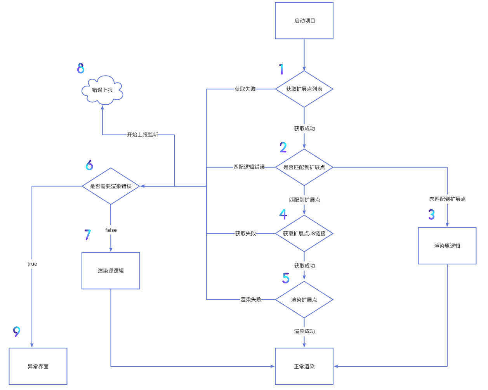
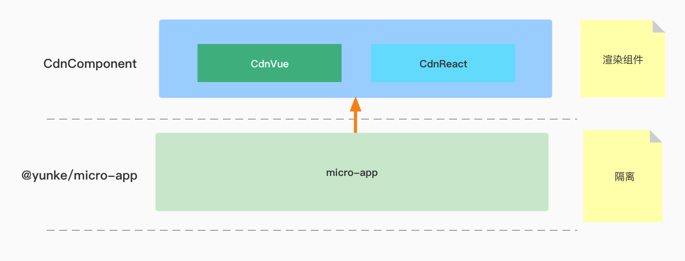
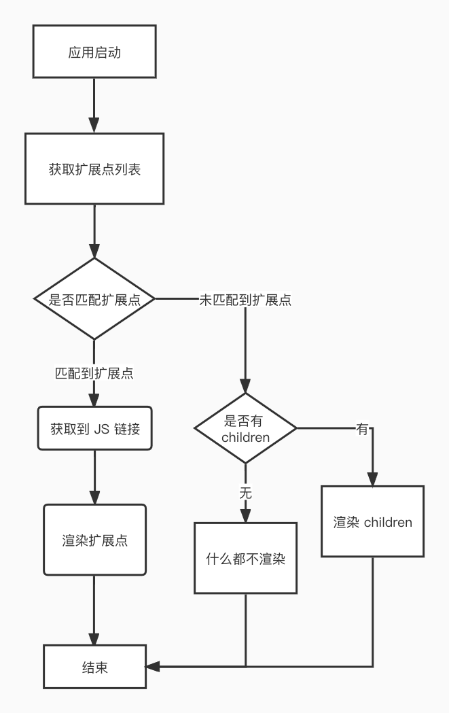
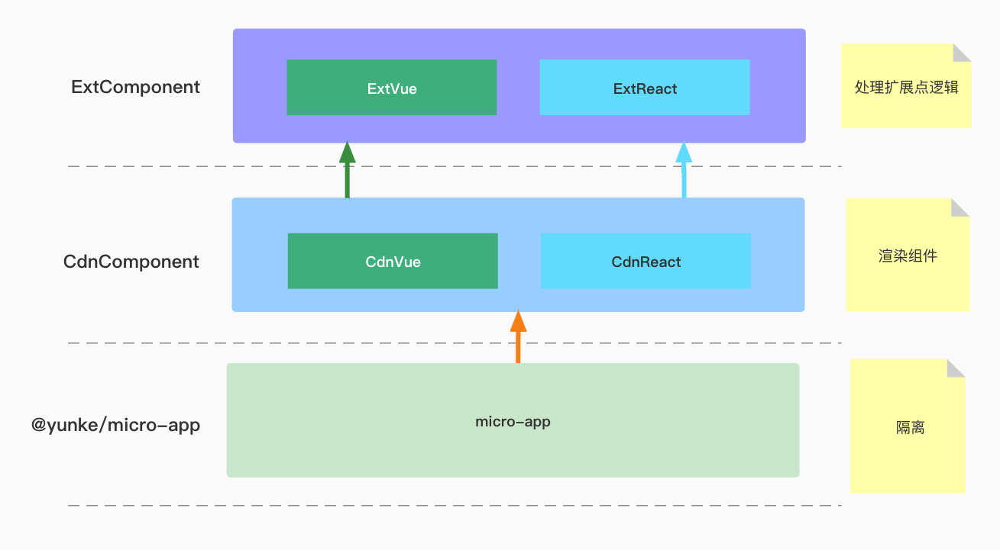

# 前端扩展点

## 背景

### 什么是扩展点

扩展点是对现有标准软件流程进行的自定义扩展, 从而满足各类客户的定制要求。

一般定制化需求目前有两种开发模式：

- 修改源代码: 直接修改原仓库代码(通过个性化灰度开关`if/else`控制具体执行逻辑)
- 扩展点：由 SVIP、业务组或租户自行开发，通过动态加载的方式（前端）或者转发代理的方式（后端）替换或者增强原公有云逻辑，其代码和公有云仓库分离，并且扩展点一次改造，后面可以横向扩展多个实现，且业务组无需再次发版。

|  | 扩展点 | 修改源代码 |
| :-- | :-- | :-- |
| **前端兼容性** | **不支持 IE 和 小程序** | 无兼容性问题 |
| 开发主体 | SVIP、业务组、第三方 | 业务组 |
| 对外宣传 | 亮点（可对外宣传，产品有自主定制化的能力） | 无 |
| 扩展性 | 高（建立在 PO 对产品扩展点规划基础上） | 低 |
| 代码灵活性 | 中（受限于插槽的位置和参数） | 高（想怎么改就怎么改） |
| 开发成本 | **业务组:**<br>• 初次：开辟插槽和确定通信参数<br>• 后期：无成本（无需再做任何事）<br><br>**扩展点开发者:**<br>• 初次：确定通信参数 + 定制化需求开发<br>• 后期：定制化需求开发 | 业务组（来一个做一个） |
| 维护性 | 依赖于开发者的插槽设计 | 依赖于开发者的代码抽象性 |
| 代码 | 独立 | 在源码中 |
| 热更新 | 支持（业务组不需要发版） | 不支持（业务组需要发版） |

### 业界实践

[**_*youzan*_**](https://doc.youzanyun.com/resource/doc/3005)

## 使用流程

### 前置

按照现有功能及需求合理拆分前端扩展点

### 扩展点管理平台

需要在扩展点管理平台, 配置扩展点仓库打包后的umd.js在线地址(上传后的cdn链接)及生效的用户规则

### 主应用

按照规划的扩展点进行扩展点埋点

### 扩展点定制化功能

对接主应用的埋点进行定制化功能开发, 将开发后的代码打包成umd.js并上传到cdn

## 前端扩展点分类

- 逻辑扩展点: 个性化逻辑
- 组件扩展点: 个性化组件

## 扩展点SDK需要支持的能力

**扩展点需要把它想的太神秘和另类，由两个能力组成 组件 + 函数，凡是平常开发能用 组件 和 函数 搞定的，扩展点都能搞定，只不过它加载的是远程的函数和组件而已，你本地是引用的本地的函数和组件。**

- 支持 `Vue`、 `React`、`Web Components` 技术栈的扩展点加载器
- 支持纯 JS 逻辑扩展
- 支持 CSS、JS 沙箱，保证安全性
- 提供了数据通信的解决方案
- 提供脚手架及扩展点模板，快速创建扩展点

## 技术架构图

```mermaid
graph TB
    %% 便签
    note1["打包构建<br/>组件文档"]
    note2["判断是否有扩展点<br/>兼容 iframe 扩展点形式<br/>兼容 图片 扩展点形式<br/>调用 CdnComponent 能力"]
    note3["各个框架组件渲染<br/>组件转 web component 能力"]
    note4["加载 UMD JS<br/>调求 Ext 服务<br/>全局配置"]

    %% 脚手架层
    subgraph layer1["脚手架层<br/>方便业务组创建扩展点"]
        scaffold_content[" "]
    end

    %% ExtComponents层
    subgraph layer2["ExtComponents 层<br/>扩展点处理层"]
        ext_react["React"]
        ext_vue["Vue"]
        ext_web["Web Components"]
        ext_more["..."]
    end

    %% CdnComponent层
    subgraph layer3["CdnComponent 层<br/>各个框架组件渲染层"]
        cdn_react["React"]
        cdn_vue["Vue"]
        cdn_web["Web Components"]
        cdn_more["..."]
        micro["micro-app<br/>web component 能力及沙箱能力"]
    end

    %% core层
    subgraph layer4["core 层<br/>框架无关的纯 JS 逻辑"]
        core_content[" "]
    end

    %% 便签指向
    note1 -.-> layer1
    note2 -.-> layer2
    note3 -.-> layer3
    note4 -.-> layer4

    %% 层级关系
    layer1 --> layer2
    layer2 --> layer3
    layer3 --> layer4

    %% 框架对应
    ext_react --> cdn_react
    ext_vue --> cdn_vue
    ext_web --> cdn_web
    ext_more --> cdn_more

    %% 汇聚关系
    cdn_react --> micro
    cdn_vue --> micro
    cdn_web --> micro
    cdn_more --> micro

    %% 样式定义
    classDef noteStyle fill:#fff2cc,stroke:#d6b656,stroke-width:2px
    classDef scaffoldStyle fill:#e3f2fd,stroke:#1976d2,stroke-width:3px
    classDef extStyle fill:#e8f5e8,stroke:#388e3c,stroke-width:3px
    classDef cdnStyle fill:#fff3e0,stroke:#f57c00,stroke-width:3px
    classDef coreStyle fill:#fce4ec,stroke:#c2185b,stroke-width:3px
    classDef frameworkStyle fill:#f3e5f5,stroke:#7b1fa2,stroke-width:1px
    classDef microStyle fill:#e0f7fa,stroke:#00838f,stroke-width:2px
    classDef hiddenStyle fill:transparent,stroke:transparent

    class note1,note2,note3,note4 noteStyle
    class layer1 scaffoldStyle
    class layer2 extStyle
    class layer3 cdnStyle
    class layer4 coreStyle
    class ext_react,ext_vue,ext_web,ext_more,cdn_react,cdn_vue,cdn_web,cdn_more frameworkStyle
    class micro microStyle
    class scaffold_content,core_content hiddenStyle
```

## 流程图



## 扩展点埋点原则

### 横向扩展原则

虽然大多数扩展点是由某个定制化诉求产生的，但在扩展点开辟的过程中，不仅仅要关注到这一个租户的需求，更注重后续的横向扩展性。

### 包裹原则

推荐尽量小的减少包裹内容, 这样可以减少后续变更的可能性。

## 方案思考

### 如何实现扩展点能力既做到执行第三方代码

1.方案一: 将原请求转发 

2.方案二: 将代码下载到本地执行 

|            | 后端 | 前端        |
| :--------- | :--- | :---------- |
| 转发       | ✅   | ✅ (iframe) |
| 加载并执行 | ❌   | ✅          |

现在问题是如何将前端代码下载到本地并执行?

- 需要下载的是什么?
- 执行得到的结果是什么?

### 远程执行结果

组件 + 函数逻辑 = 前端应用

- 需要下载的是什么: js
- 执行得到的结果是什么: 组件/函数

### 组件的加载和执行

扩展点如何做? -> 前端代码下载并执行 -> 组件的加载并执行

#### 基础能力

- 动态加载和渲染
- 数据通信

#### 额外能力

- 支持多技术栈
- 保证第三方安全性: JS沙箱和CSS隔离

### 技术详解

#### 组件动态加载和渲染

#### 前置知识

- 组件在数据层面是什么: 就是一个对象
- 组件如何动态渲染: `<component :is='Com'>`
- UMD: 一种在运行时兼容`CommonJs`、`AMD`、`无模块`等规范于一身的实现, 无法兼容`ES MODULE`

```js
(function (global, factory) {
  // CommonJS 规范
  typeof exports === 'object' && typeof module !== 'undefined'
    ? (module.exports = factory(require('vue')))
    : // AMD 规范
      typeof define === 'function' && define.amd
      ? define(['vue'], factory)
      : // 普通浏览器
        ((global = typeof globalThis !== 'undefined' ? globalThis : global || self),
        (global.Com = factory(global.Vue)));
})(this, function () {
  'use strict';
  function Com() {
    console.log('我是一个组件');
  }
  return Com;
});
```

- UMD JS加载
  - `RequireJs` / `SystemJs` 模块加载器
  - `fetch`源码 + `eval` / `new Function` 执行(没有开源, 自己开发)

|        | RequireJs | SystemJs | fetch + eval |
| :----- | :-------- | :------- | ------------ |
| 大小   | 86.5KB    | 33.6KB   | 1KB          |
| 可靠性 | ⭐⭐⭐    | ⭐⭐⭐   | ⭐           |

最终方案：[SystemJS](https://github.com/systemjs/systemjs) ✨

#### 组件加载源码实现

```vue
<!-- 源码 -->
<template>
  <component :is="Com" v-bind="comProps" />
</template>

<script>
import 'systemjs/dist/system';

import * as Vue from 'vue';

window.Vue = Vue;

export default {
  name: 'CdnComponent',
  props: {
    url: {
      // 组件 URL
      type: String,
      required: true
    },
    comProps: {
      // 组件属性
      type: Object,
      default: () => ({})
    }
  },
  data() {
    return {
      Com: null
    };
  },
  methods: {
    loadCom() {
      window.System.import(this.url).then(res => {
        this.Com = res;
      });
    }
  },
  created() {
    this.loadCom();
  }
};
</script>
```

```vue
<!-- 使用 -->
<cdn-component :url="url" :com-props="{ msg: 'Hello Vue 3 + Vite' }" />
```

`<CdnComponent />`被称为组件加载器

### 数据通信

#### 通信方式选择

- 发布订阅的事件机制
- 属性透传方式
- 其他...

属性透传: 简单、无学习成本、符合日常习惯

```vue
<cdn-component :url="url" :com-props="{ msg: 'Hello Vue 3 + Vite' }" />
```

```vue
<component :is="Com" v-bind="comProps" />

<script>
export default {
  name: 'CdnComponent',
  props: {
    comProps: {
      // 组件属性
      type: Object,
      default: () => ({})
    }
  }
};
</script>
```

### 多技术栈

加载器用什么技术栈实现?

```html
<!-- React、Vue or Others? -->
<CdnComponent></CdnComponent>
```

- 纯 Web Components, 一次书写, 到处使用([taro3](https://github.com/NervJS/taro/tree/main/packages/taro-components/src/components)方案)
- React、Vue同样逻辑, 不同技术栈实现

#### Web Components

##### 概念、定义和使用

Web Components 是浏览器原生支持的组件开发方式, 能够跨技术栈。

```js
// 定义 web components
class HelloWorld extends HTMLElement {
  // 响应式 props
  static get observedAttributes() {
    return ['msg'];
  }

  constructor() {
    super();
  }

  // 默认会出发一次，类似 useEffect
  attributeChangedCallback(name, oldValue, newValue) {
    this.innerHTML = `<h1>你好，${newValue}</h1>`;
  }
}

// 注册
customElements.define('hello-world', HelloWorld);
```

```html
<!-- 使用 web components -->
<hello-world msg="张三" />
```

##### Shadow DOM 和 样式隔离

`Shadow DOM`的主要作用是将 HTML 结构和 CSS 样式隐藏并隔离起来。不过有以下注意点:

- 无法隔离JS
- 无法影响到外部, 但也无法继承外部样式

```js
class HelloWorldShadow extends HTMLElement {
  constructor() {
    super();
    // 使用 attachShadow 创建 shadowDOM
    this.shadowDOM = this.attachShadow({ mode: 'open' });
  }

  attributeChangedCallback(name, oldValue, newValue) {
    // 修改 shadowDOM
    this.shadowDOM.innerHTML = `<h1>你好，${newValue}</h1>`;
  }
}
```

```html
<!-- 使用 web components -->
<hello-world-shadow msg="张三" />
```

##### 工具和未来展望

Web Components 工具

- [lit](https://github.com/lit/lit)
- [stenciljs](https://github.com/stenciljs/core)

#### 加载器用什么技术栈实现

```html
<!-- React、Vue or Others? -->
<CdnComponent></CdnComponent>
```

- 纯 Web Components, 一次书写, 到处使用([taro3](https://github.com/NervJS/taro/tree/main/packages/taro-components/src/components)方案)
- React、Vue同样逻辑, 不同技术栈实现 ✅

Web Components 问题:

- 无法处理 antd/element 表单联动场景

#### 源码展示

##### vue

```vue
<!-- vue 技术栈 -->
<template>
  <component :is="Com" v-bind="comProps" />
</template>

<script>
export default {
  name: 'CdnComponent',
  props: {
    url: String,
    comProps: Object
  },
  data() {
    return {
      Com: null
    };
  },
  methods: {
    loadCom() {
      window.System.import(this.url).then(res => {
        this.Com = res;
      });
    }
  },
  created() {
    this.loadCom();
  }
};
</script>
```

##### React

```js
function CdnComponent({ url, comProps }) {
  const [Com, setCom] = useState(null)

  // 请求并动态加载内容
  useEffect(() => {
    (window as any).System.import(url).then(res => {
      setCom(() => res.default)
    })
  }, [url])

  // 渲染组件
  return Com ? React.createElement(Com, comProps) : null
}
```

#### 架构图


### Angular场景--跨技术栈

#### 背景

不想在旧项目上继续写Angular

#### 如何让加载器能够跨技术栈

##### Angular、React 混用

含义：Angular 和 React 混用，所以加载器就还是 React 技术栈，扩展点组件也用 React 技术栈。

结论：目前业界没有让两个技术栈同时使用的奇葩场景和方案，并且租户后台项目较老，Webpack 改造风险较大

##### React + Web Components

含义：仍然使用 React 技术栈实现加载器，但是通过 Web Components 包一层后，使其能跨技术栈

结论：目前业界已经有开源的解决方案——[magic-microservices](https://github.com/bytedance/magic-microservices/blob/main/README-zh_CN.md), 可以轻松实现。

##### 源码讲解

```js
import magic from '@magic-microservices/magic';
// 将 React 组件转为原生 Web Components
import React from 'react';
import ReactDOM from 'react-dom';

// 引入 React 技术栈组件加载器
import CdnComponent from './CdnComponent';

magic(
  'cdn-component',
  {
    // 挂载
    mount: (container, props) => {
      ReactDOM.render(React.createElement(CdnComponent, props, null), container);
    },
    // 更新
    updated(attrName, value, container, props) {
      ReactDOM.render(React.createElement(CdnComponent, props, null), container);
    }
  },
  { propTypes: { url: String, comProps: Object } }
);
```

```html
<!-- 使用 -->
<cdn-component url="xxx" />
```

### JS沙箱和CSS隔离

#### 重点 + 难点

没有开源的!

- 从微前端框架中抽离沙箱逻辑
- 改造[micro-app](https://github.com/jd-opensource/micro-app)

#### micro-app 改造

- 增加`componentMode`属性
- 获取HTML时, 手动拼接HTML即可

```js
export default function extractHtml(app, componentMode) {
  // 组件模式
  if (componentMode) {
    // 直接返回拼接好的 HTML
    return Promise.resolve(`<micro-app-head><script src='${app.url}'></script></micro-app-head>`);
  }

  // 请求远程的 HTML
  return fetchSource(app.url, app.name, { cache: 'no-cache' });
}
```

#### 改造后架构



默认不开启沙箱

### 业务简介

#### 运行流程



```js
const checker = (conditions) => conditions.orgcode == store.state.orgcode
<ExtComponent name='demo1' checker={checker}></ExtComponent> // 扩展点加载器
```

```js
[
  {
    name: 'demo1',
    url: 'https://res.cn/cdnjs/demo1/index.umd.js',
    conditions: {
      orgcode: 'aaa'
    }
  },
  {
    name: 'demo2',
    url: 'https://res.cn/cdnjs/demo2/index.umd.js',
    conditions: {
      userName: 'jack'
    }
  }
];
```

#### 架构总览



## 最终方案

### 基础功能(仅支持Vue)

- umd.js动态加载: [SystemJS](https://github.com/systemjs/systemjs) ✨(改为自己开发的loadScript?)
- 组件动态渲染: 依赖vue动态组件: `<component :is='Com'>`
- 数据通信: 依赖vue属性透传

### 支持多技术栈(React)

- React: 使用React语法再实现一遍功能

### 扩展功能

- 跨技术栈(比如非React的主应用加载React前端扩展点): 使用[magic-microservices](https://github.com/bytedance/magic-microservices/blob/main/README-zh_CN.md)

## 针对方案的疑问点

- 为什么不适用 `Systemjs`, 而是自己开发umd.js动态加载工具?
