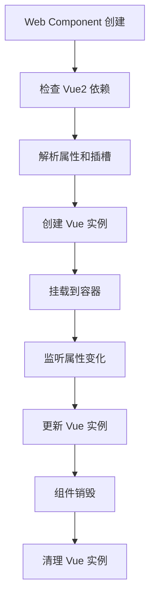

# @frontendUtils/ext-wc-vue2

Vue2 技术栈的 Web Components 扩展点组件库。基于 [@magic-microservices/magic](https://github.com/magic-microservices/magic) 将 Vue2 扩展点组件封装为 Web Components，支持跨框架使用。

## 特性

✨ **跨框架兼容**: 将 Vue2 组件封装为 Web Components，可在任何前端框架中使用  
🔄 **动态加载**: 支持运行时动态加载扩展点组件  
🎯 **插槽支持**: 完整支持 Vue2 插槽系统  
🛡️ **错误处理**: 内置错误捕获和处理机制  
⚡ **性能优化**: 防抖处理、懒加载等性能优化  
🎨 **样式隔离**: 支持 Shadow DOM 样式隔离  

## 安装

```bash
npm install @frontendUtils/ext-wc-vue2
```

## 依赖要求

- Vue 2.x (全局引入)
- 现代浏览器支持 Web Components

## 快速开始

### 1. 引入依赖

```html
<!-- Vue 2.x -->
<script src="https://unpkg.com/vue@2.7.14/dist/vue.min.js"></script>
<!-- ext-wc-vue2 -->
<script src="https://unpkg.com/@frontendUtils/ext-wc-vue2/dist/index.umd.js"></script>
```

### 2. 使用 Web Component

```html
<ext-component 
  name="my-extension"
  export-name="MyComponent"
  dev-url="http://localhost:3000/my-component.js">
  
  <!-- 默认插槽 -->
  <div>默认内容</div>
  
  <!-- loading 插槽 -->
  <div slot="loading">
    <div class="spinner">加载中...</div>
  </div>
  
  <!-- error 插槽 -->
  <div slot="error">
    <div class="error">加载失败</div>
  </div>
  
</ext-component>
```

## API 参考

### 属性 (Attributes)

| 属性名 | 类型 | 默认值 | 说明 |
|--------|------|--------|------|
| `name` | `string` | - | 扩展点组件名称 |
| `checker` | `function\|string` | - | 检查器函数，为字符串时不渲染 |
| `wc-mode` | `boolean` | `false` | Web Components 模式 |
| `com-props` | `object` | `{}` | 传递给组件的属性 |
| `styles` | `object` | - | 组件样式对象 |
| `class-name` | `string` | - | CSS 类名 |
| `disable-scopecss` | `boolean` | `false` | 禁用样式作用域 |
| `disable-sandbox` | `boolean` | `false` | 禁用沙箱模式 |
| `shadow-dom` | `boolean` | `false` | 启用 Shadow DOM |
| `error-handler` | `function` | - | 错误处理函数 |
| `export-name` | `string` | - | 导出组件名称 |
| `loading-handler` | `function` | - | 加载状态处理函数 |
| `block-on-error` | `boolean` | `true` | 错误时是否阻塞渲染 |
| `dev-url` | `string` | - | 开发环境 URL |

### 插槽 (Slots)

| 插槽名 | 说明 |
|--------|------|
| `default` | 默认插槽内容 |
| `loading` | 加载状态显示内容 |
| `error` | 错误状态显示内容 |

### 事件 (Events)

| 事件名 | 参数 | 说明 |
|--------|------|------|
| `error` | `CustomEvent<Error>` | 组件加载或渲染错误时触发 |
| `loading` | `CustomEvent<boolean>` | 加载状态变化时触发 |

## 使用示例

### 基础使用

```html
<!DOCTYPE html>
<html>
<head>
  <script src="https://unpkg.com/vue@2.7.14/dist/vue.min.js"></script>
  <script src="https://unpkg.com/@frontendUtils/ext-wc-vue2/dist/index.umd.js"></script>
</head>
<body>
  <ext-component 
    name="user-profile"
    export-name="UserProfile"
    dev-url="http://localhost:3000/user-profile.js">
    <div>加载用户信息中...</div>
  </ext-component>
</body>
</html>
```

### 传递属性

```html
<ext-component 
  name="data-table"
  export-name="DataTable"
  com-props='{"columns": ["name", "age"], "data": [{"name": "张三", "age": 25}]}'
  dev-url="http://localhost:3000/data-table.js">
</ext-component>
```

### 自定义加载和错误处理

```html
<ext-component 
  name="chart-component"
  export-name="ChartComponent"
  dev-url="http://localhost:3000/chart.js"
  error-handler="handleChartError"
  loading-handler="handleChartLoading">
  
  <div slot="loading">
    <div class="loading-spinner">图表加载中...</div>
  </div>
  
  <div slot="error">
    <div class="error-message">图表加载失败，请稍后重试</div>
  </div>
  
</ext-component>

<script>
function handleChartError(error) {
  console.error('图表组件错误:', error);
  // 发送错误报告
}

function handleChartLoading(isLoading) {
  console.log('图表加载状态:', isLoading);
  // 更新全局加载状态
}
</script>
```

### 样式定制

```html
<ext-component 
  name="custom-button"
  export-name="CustomButton"
  class-name="my-button"
  styles='{"backgroundColor": "#007bff", "color": "white", "padding": "10px 20px"}'
  dev-url="http://localhost:3000/button.js">
  点击我
</ext-component>

<style>
.my-button {
  border-radius: 4px;
  border: none;
  cursor: pointer;
}

.my-button:hover {
  opacity: 0.9;
}
</style>
```

## 开发指南

### 构建项目

```bash
# 安装依赖
npm install

# 构建
npm run build

# 监听模式构建
npm run build:watch

# 清理构建文件
npm run clean
```

### 目录结构

```
packages/ext-wc-vue2/
├── src/
│   ├── ExtComponent.ts    # 主组件实现
│   ├── index.ts          # 入口文件
│   ├── types.d.ts        # 类型定义
│   └── utils.ts          # 工具函数
├── dist/                 # 构建输出
├── package.json
├── rollup.config.mjs     # 构建配置
├── tsconfig.json         # TypeScript 配置
└── README.md
```

### 核心模块

#### ExtComponent.ts
主要的 Web Component 实现，包含：
- Vue 实例的创建和管理
- 属性映射和更新
- 插槽内容处理
- 错误和加载状态管理

#### utils.ts
工具函数集合：
- `htmlToVue2VNode`: HTML 元素转 Vue2 VNode
- `getSlot`: 获取插槽元素
- `getVue2Node/getVue2Children`: Vue2 节点转换
- `fire`: 发送自定义事件

## 技术架构

### 组件生命周期



### 插槽转换流程

1. **HTML 插槽解析**: 从 Web Component 中提取 `slot` 属性的元素
2. **VNode 转换**: 将 HTML 元素转换为 Vue2 VNode
3. **样式处理**: 清理和转换 CSS 样式
4. **事件绑定**: 处理 HTML 属性中的事件处理器
5. **插槽注入**: 将转换后的 VNode 注入到 Vue 组件插槽中

## 兼容性

- **Vue**: 2.6+ (推荐 2.7+)
- **浏览器**: Chrome 67+, Firefox 63+, Safari 10.1+, Edge 79+
- **Node.js**: 16+ (构建环境)

## 注意事项

1. **Vue2 依赖**: 必须全局引入 Vue 2.x，Web Component 会自动检查依赖
2. **属性传递**: 复杂对象属性需要使用 JSON 字符串格式
3. **样式隔离**: 使用 `shadow-dom` 属性可以启用样式隔离，但可能影响全局样式
4. **事件处理**: HTML 属性中的事件处理器会被转换为 Vue 事件监听器
5. **性能考虑**: 组件使用防抖机制处理频繁的属性更新

## 常见问题

### Q: 为什么组件没有渲染？
A: 请检查：
- Vue 2.x 是否正确引入
- `name` 和 `export-name` 属性是否正确设置
- 远程组件 URL 是否可访问
- 浏览器控制台是否有错误信息

### Q: 如何传递复杂的属性？
A: 使用 `com-props` 属性传递 JSON 字符串：
```html
<ext-component com-props='{"user": {"id": 1, "name": "张三"}}'></ext-component>
```

### Q: 插槽内容没有正确显示？
A: 确保：
- 插槽元素有正确的 `slot` 属性
- 远程组件正确定义了对应的插槽
- 检查样式是否被隐藏（组件会自动隐藏原始插槽元素）

## 许可证

MIT License - 详见 [LICENSE](./LICENSE) 文件 